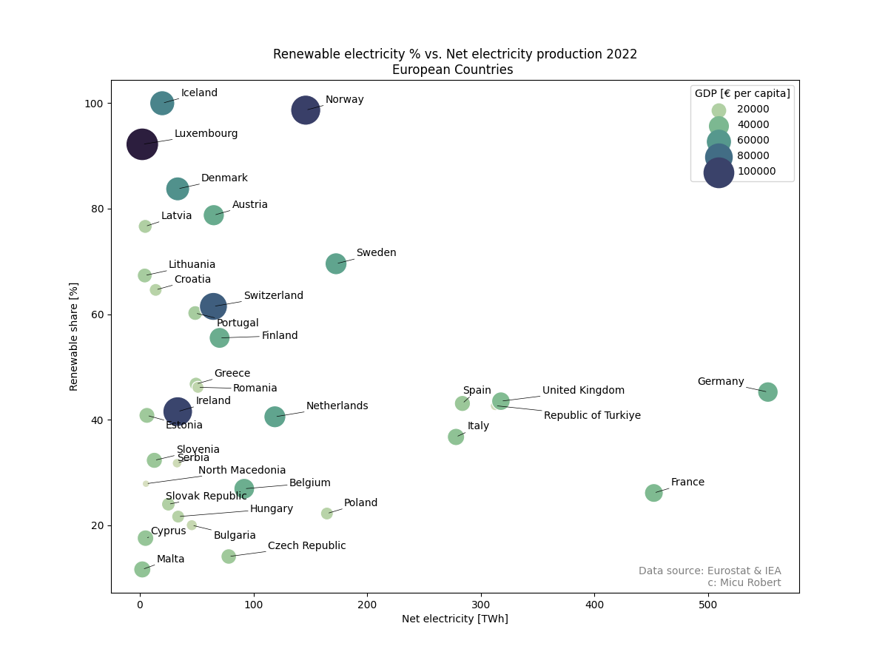

# Project Name

Renewable electricity share vs Net electricity production. Focusing the GDP per capita.

## Description

Analyzed data from Eurostat and International Energy Association(IEA). For the IEA data, I built a bot that downloads the data from their website.

I integrated the GDP per capita in the resulted graph to emphasize the correlation between the renewable share and the GDP per capita.

